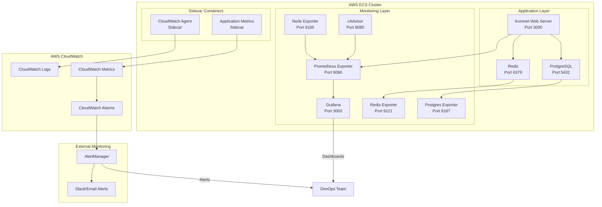

# Koronet Web Server Monitoring Architecture

## High-Level Monitoring Setup

## Monitoring Components

### 1. Application Monitoring
- **Koronet Web Server**: Custom metrics for request count, response time, error rate
- **PostgreSQL**: Database connection pool, query performance, slow queries
- **Redis**: Cache hit/miss ratio, memory usage, connection count

### 2. Infrastructure Monitoring
- **Node Exporter**: System metrics (CPU, memory, disk, network)
- **cAdvisor**: Container metrics (resource usage, restart count)
- **Prometheus**: Metrics collection and storage
- **Grafana**: Visualization and dashboards

### 3. AWS CloudWatch Integration
- **CloudWatch Agent**: System and application logs
- **CloudWatch Metrics**: Custom application metrics
- **CloudWatch Alarms**: Automated alerting based on thresholds

### 4. Alerting
- **AlertManager**: Handles alerts from Prometheus
- **Notification Channels**: Slack, email, PagerDuty integration

## Key Metrics to Monitor

### Application Metrics
- HTTP request rate and response time
- Database connection pool utilization
- Redis cache performance
- Error rates and status codes

### Infrastructure Metrics
- CPU and memory utilization
- Disk I/O and space
- Network throughput
- Container health and restarts

### Business Metrics
- Active user sessions
- API endpoint usage
- Database query performance
- Cache effectiveness

## Alerting Rules

### Critical Alerts
- Application down (HTTP 5xx errors > 5%)
- Database connection failures
- High memory usage (> 90%)
- Disk space low (< 10% free)

### Warning Alerts
- High response time (> 2 seconds)
- Cache miss rate high (> 50%)
- CPU usage high (> 80%)
- Unusual traffic patterns
